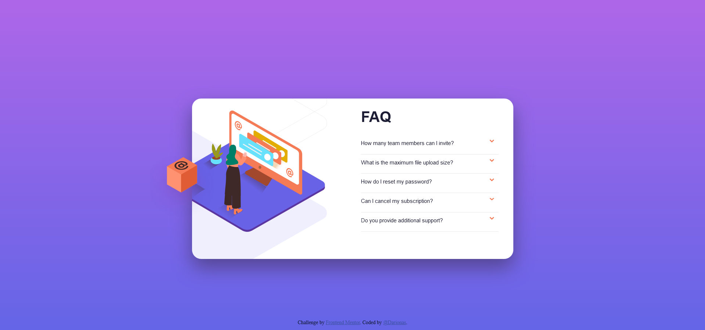

# Frontend Mentor - FAQ accordion card solution

This is a solution to the [FAQ accordion card challenge on Frontend Mentor](https://www.frontendmentor.io/challenges/faq-accordion-card-XlyjD0Oam).

## Table of contents

- [Overview](#overview)
  - [The challenge](#the-challenge)
  - [Screenshot](#screenshot)
  - [Links](#links)
- [My process](#my-process)
  - [Built with](#built-with)
  - [What I learned](#what-i-learned)
  - [Continued development](#continued-development)
  - [Useful resources](#useful-resources)
- [Author](#author)
- [Acknowledgments](#acknowledgments)

## Overview

### The challenge

Users should be able to:

- View the optimal layout for the component depending on their device's screen size
- See hover states for all interactive elements on the page
- Hide/Show the answer to a question when the question is clicked

### Screenshot

### Links

- Solution URL: (https://github.com/Darionas/faq-accordion-card)
- Live Site URL: (https://darionas.github.io/faq-accordion-card/)

## My process

* Set HTML layout:
* Create CSS external file to set style for HTML layout:
  * Choose to use responsive web design:
    * use grid layout module:
      * to create mobile layout first
      * to create desktop layout.
    * use rem, vw css units for HTML elements to make them responsive.
    * use media queries to set breakpoint for desktop devices.
  * Use css techniques to center vertically or horizontally.
  * Use overflow property to hide some image elements parts, which are outside of the container.
  * Use z-index property to front one of overlap elements.
  * Use transition property which allows to change property values smoothly, over a given duration 
* Create external JavaScript file:
  * Loop all accordions buttons
  * When 'click' event occurs on one of accordions execute anonymous function
  * It lets toggle icons and accordion's hidden/shown elements.

### Built with

It is based on:

- HTML
- CSS (RWD)
- JavaScript

### What I learned

In this challange I learned:

- Use grid layout module
- Positioning images
- Set z-index property on elements
- create hoverable, interactive accordion's to hide/show it's elements.
- Set media queries for devices.

### Continued development

- Markdown Guide.
- JavaScript.

### Useful resources

- [w3schools](https://www.w3schools.com/css/css_grid.asp) - It's explains how to implement grid layout module.
- [yutube](https://www.youtube.com/playlist?list=PL4cUxeGkcC9itC4TxYMzFCfveyutyPOCY) - Great tutorial about grid layout for beginners.
- [w3schools](https://www.w3schools.com/css/css_positioning.asp) - This helped me for positioning elements.
- [w3schools](https://www.w3schools.com/css/css_z-index.asp) - This lets me set priorities for elements, which element should be placed in front of, or behind, the others.
- [w3schools](https://www.w3schools.com/css/css3_mediaqueries.asp) - It lets me ajust screen for mobile devices at specified breakpoint.
- [JSFiddle](https://jsfiddle.net/o6j49dcy/) - This is a perfect example how to employ javaScript to make accordions interactive.

## Author

- Frontend Mentor - [@Darionas](https://www.frontendmentor.io/profile/Darionas)

## Acknowledgments

Thank you Frontend Mentor team for opportunity to try, practice, train yourself in different level challenges and gain invaluable experience.
Thank you @Vikram from Frontend Mentor for guidance.
